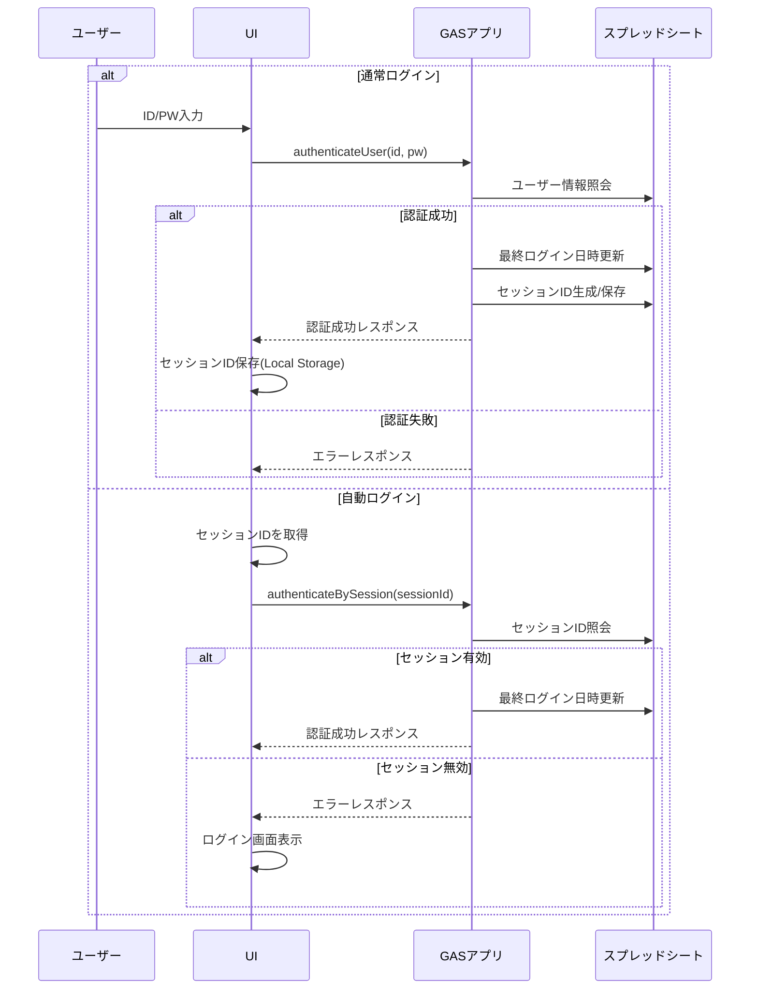

# フォーム管理システム 詳細設計書

## 1. システム概要

### 1.1 目的
複数のGoogleフォームを一元管理し、簡易なID/パスワード認証と自動ログイン機能を提供することで、ユーザーが複数のフォームに容易にアクセスできる環境を構築します。

### 1.2 主要機能
- シンプルなID/パスワードによるユーザー認証
- セッション管理による自動ログイン機能
- テンプレートフォームからのユーザー専用フォーム自動生成
- ユーザーへのフォーム編集権限の自動付与
- Googleサイトに埋め込み可能なフォームアクセスボタン

### 1.3 ユーザー体験フロー
1. 初回：ユーザー登録 → アクセスID/PW取得 → ログイン → フォーム生成 → フォームアクセス
2. 2回目以降：ログイン（または自動認証） → フォームアクセス

## 2. システムアーキテクチャ


### 2.1 コンポーネント説明
- **Googleサイト**: ユーザーインターフェースを提供し、GASウェブアプリを埋め込み
- **GASウェブアプリ**: システムのコアロジックを実装、認証・フォーム生成を処理
- **スプレッドシートDB**: ユーザー情報とフォーム情報を管理
- **テンプレートフォーム**: 複製元となる標準フォーム
- **ユーザーフォーム**: ユーザーごとに生成された固有のフォーム

## 3. データモデル

### 3.1 スプレッドシート構造

#### 3.1.1 ユーザー管理シート
```
| アクセスID | パスワード | Googleアカウント | 登録日時 | 最終ログイン日時 | 自動ログインフラグ | セッションID |
|-----------|-----------|----------------|---------|--------------|----------------|------------|
| A12B3     | a4b2c     | user@example.com | 2025/04/18 | 2025/04/18 | TRUE | uuid-string |
```

#### 3.1.2 フォーム管理シート
```
| アクセスID | Googleアカウント | フォーム種類 | フォームID | フォームURL | 作成日時 |
|-----------|----------------|-----------|---------|----------|---------|
| A12B3     | user@example.com | アンケートA | 1FAIpQL... | https://... | 2025/04/18 |
```

#### 3.1.3 設定シート
```
| 設定項目 | 値 |
|---------|-----|
| システム名 | フォーム管理システム |
| バージョン | 1.0.0 |
| テンプレート: アンケートA | テンプレートID |
```

### 3.2 エンティティ関係


## 4. 処理フロー詳細

### 4.1 初期セットアップ


### 4.2 ユーザー登録プロセス


### 4.3 認証プロセス



### 4.4 フォーム生成プロセス


### 4.5 フォームボタン処理


## 5. コード構造

### 5.1 サーバーサイド (GAS) ファイル構成

```
- Code.gs (メインスクリプト)
  - 初期化・セットアップ関連関数
  - ユーザー認証関連関数 
  - フォーム管理関連関数
  - ユーティリティ関数
  - ログ出力関数
```

### 5.2 クライアントサイド (HTML/JS) ファイル構成

```
- Index.html (メインHTMLテンプレート)
  - ログイン/登録フォーム
  - フォーム管理UI
  - フォームボタンデモUI
  - クライアントサイドJavaScriptコード
```

## 6. セキュリティ考慮事項

### 6.1 認証セキュリティ
- セッションIDはUUIDを使用し、ブラウザのローカルストレージに保存
- パスワードは平文保存（MVPフェーズ）だが、本番環境ではハッシュ化を検討
- 認証情報はメールでも送信（本番環境）

### 6.2 アクセス制御
- フォームへのアクセスは認証済みユーザーのみ可能
- フォームの編集権限は対応するGoogleアカウントのみに付与
- ユーザー間でのフォームアクセス分離

## 7. 将来の拡張性

### 7.1 潜在的な機能追加
- フォーム回答の集計・分析機能
- ユーザーグループとアクセス制御の強化
- 複数のテンプレートバリエーションからの選択
- メール通知機能の強化

### 7.2 スケーラビリティ考慮事項
- 大量フォーム生成時のパフォーマンス最適化
- スプレッドシートの行数制限（1,000,000行）への対応
- GASの実行時間制限（6分/実行）への対応

## 8. 実装ステップ

1. **フェーズ1: 基盤構築**
   - スプレッドシート自動生成
   - ユーザー登録・認証機能

2. **フェーズ2: フォーム管理**
   - テンプレートからフォーム作成
   - フォーム一覧表示

3. **フェーズ3: セッション管理**
   - 自動ログイン機能
   - セッション管理

4. **フェーズ4: ボタンシステム**
   - フォームボタン機能
   - 埋め込み対応

## 9. テスト計画

### 9.1 テスト項目
1. スプレッドシート自動生成テスト
2. ユーザー登録・認証テスト
3. フォーム生成・複製テスト
4. 自動ログイン・セッション管理テスト
5. フォームボタン機能テスト

### 9.2 テスト環境
- 開発環境: Google Apps Scriptエディタ
- テスト環境: Googleサイトプレビュー
- 本番環境: 公開Googleサイト

## 10. 運用考慮事項

### 10.1 メンテナンス
- GASの実行クォータ監視
- スプレッドシートのバックアップ
- テンプレートフォームの更新管理

### 10.2 トラブルシューティング
- エラーログの確認方法
- よくある問題と解決策
- 権限エラーの対処法

### 10.3 フォーム管理運用ルール

#### 10.3.1 テスト環境と本番環境の違い
- **テスト環境**: 開発・テスト目的で、システムがテンプレートフォームを自動生成することを許可
- **本番環境**: マスターとなるGoogleフォームは管理ユーザーが別途作成し、システムに登録する運用とする

#### 10.3.2 マスターフォーム管理ルール
- マスターフォーム（テンプレート）は管理ユーザーが事前に作成し、適切な構造と設問を設定する
- 作成したマスターフォームのIDを設定シートの「テンプレート: フォーム名」項目に登録する
- マスターフォームの更新・変更は管理ユーザーの責任で行い、変更後は設定シートの情報も更新する
- システムはマスターフォームを複製するのみで、マスターフォーム自体の作成・編集機能は提供しない

#### 10.3.3 管理ユーザーの役割と責任
- マスターフォームの作成・管理・更新
- システムへのマスターフォーム情報の登録
- ユーザーアカウントの管理（必要に応じて）
- フォーム構造の標準化と品質確保

---

この設計書をベースに、MVPの開発を進めていきます。各機能は段階的に実装し、動作確認を行いながら進めていきます。